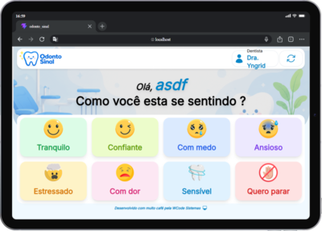

# 🦷 Odonto Sinal

Aplicação desenvolvida para auxiliar na comunicação acessível durante atendimentos odontológicos infantis e para pacientes com dificuldades de comunicação, incluindo surdos e pessoas não verbais.

O sistema permite que pacientes expressem como estão se sentindo durante procedimentos odontológicos através de emoções visuais e interativas.

---

# ✨ Objetivo

Facilitar a comunicação entre:

* 👦 Crianças
* 🧏 Pacientes com dificuldade de comunicação
* 👩‍⚕️ Dentistas
* 🦷 Atendimento odontológico

Especialmente para:

* pacientes surdos
* pessoas não verbais
* crianças ansiosas
* atendimentos infantis
* ambientes inclusivos
* comunicação rápida durante procedimentos

---

Características:
* visual moderno
* layout clean
* botões grandes para toque
* alto contraste
* acessibilidade
* experiência amigável e intuitiva
* foco em tablets e telas touch

---

# 🚀 Tecnologias Utilizadas

* React
* Vite
* Tailwind CSS
* SweetAlert2
* Heroicons
* Fontsource Inter

---

# 📦 Instalação

Clone o projeto:

```bash
git clone https://github.com/seu-repositorio/odonto-sinal.git
```

Entre na pasta:

```bash
cd odonto-sinal
```

Instale as dependências:

```bash
npm install
```

Execute o projeto:

```bash
npm run dev
```

---

# 🧠 Funcionalidades

✅ Alteração do nome do paciente
✅ Emoções ilustradas
✅ Interface responsiva
✅ Layout otimizado para tablets
✅ Design acessível
✅ Comunicação visual rápida
✅ UX focada em inclusão

---

# 😌 Emoções Disponíveis

* 😌 Tranquilo
* 🙂 Confiante
* 😨 Com medo
* 😰 Ansioso
* 😣 Estressado
* 😖 Com dor
* 🦷 Sensível
* ✋ Quero parar

---

# 📱 Responsividade

O sistema foi pensado principalmente para:

* tablets
* iPads
* telas touch

Mas também funciona em:

* desktop
* celular

---

# 🦷 Screenshots



---

# 💡 Melhorias Futuras

* áudio por emoção
* síntese de voz
* tradução em Libras
* painel do dentista
* histórico emocional
* acessibilidade avançada
* animações interativas
* integração com backend
* suporte multilíngue

---

# 👨‍💻 Desenvolvido por

WCode Sistemas

Desenvolvido com muito café ☕ pela WCode Sistemas
